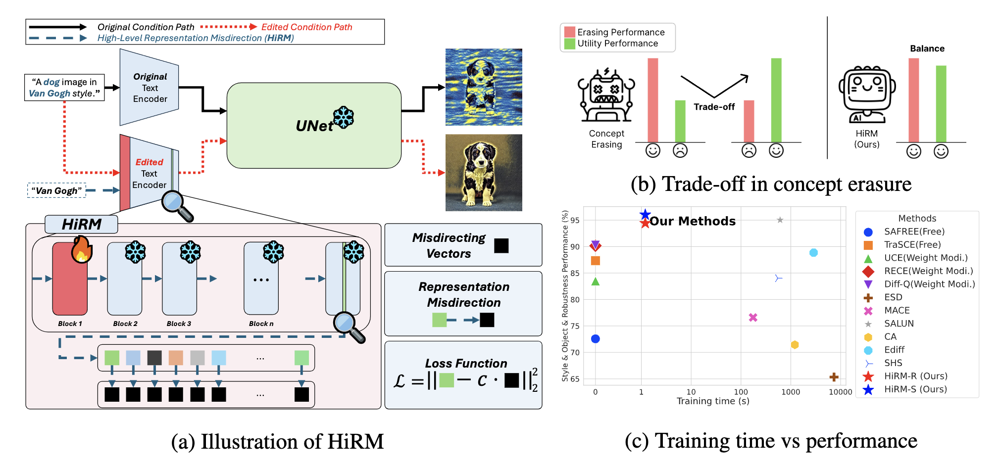

# [ICLR 2026] Localized Concept Erasure in Text-to-Image Diffusion Models via High-Level Representation Misdirection
<p align="center">
  
</p>

## 📌 Abstract

Recent advances in text-to-image (T2I) diffusion models have seen rapid and widespread adoption. However, their powerful generative capabilities raise concerns about potential misuse for synthesizing harmful, private, or copyrighted content. To mitigate such risks, concept erasure techniques have emerged as a promising solution. Prior works have primarily focused on fine-tuning the denoising component (e.g., the U-Net backbone). However, recent causal tracing studies suggest that visual attribute information is localized in the early self-attention layers of the text encoder, indicating a potential alternative for concept erasing. Building on this insight, we conduct preliminary experiments and find that directly fine-tuning early layers can suppress target concepts but often degrades the generation quality of non-target concepts. To overcome this limitation, we propose High-Level Representation Misdirection (HiRM), which misdirects high-level semantic representations of target concepts in the text encoder toward designated vectors such as random directions or semantically defined directions (e.g., supercategories), while updating only early layers that contain causal states of visual attributes. Our decoupling strategy enables precise concept removal with minimal impact on unrelated concepts, as demonstrated by strong results on UnlearnCanvas and NSFW benchmarks across diverse targets (e.g., objects, styles, nudity). HiRM also preserves generative utility at low training cost, transfers to state-of-the-art architectures such as Flux without additional training, and shows synergistic effects with denoiser-based concept erasing methods.

## Environment Setup
    conda env create -f environment.yml
    conda activate <env_name>

## 📂 Datasets
### 1. Prepare the UnlearnCanvas Benchmark
Download [classifier checkpoints](https://drive.google.com/drive/folders/1AoazlvDgWgc3bAyHDpqlafqltmn4vm61) and [diffusion model checkpoint](https://drive.google.com/drive/folders/18tN-7LuxQ89I-MDSjtB5to2dGHDMHyqb).
* style50_cls.pth : object classifier checkpoint
* style50.pth : style classifier checkpoint
* diffusion model checkpoint : model pipeline fine‑tuned on the UnlearnCanvas dataset
### 2. Prepare the Adversarial Benchmarks
You can access the adversarial benchmarks used in this paper through the following links (some of the require approval from the original authors) :
* [I2P](https://huggingface.co/datasets/AIML-TUDA/i2p)
* [MMA-Diffusion](https://huggingface.co/datasets/YijunYang280/MMA-Diffusion-NSFW-adv-prompts-benchmark)
* [Ring-A-Bell](https://huggingface.co/datasets/Chia15/RingABell-Nudity)
* [Prompt3Debugging (P4D)](https://huggingface.co/datasets/joycenerd/p4d)
* [UnLearnDiffAtk](https://github.com/OPTML-Group/Diffusion-MU-Attack/blob/main/prompts/nudity.csv)


## 🔥 Save the Stable Diffusion pipeline
❗️ Our experiments were conducted using SD1.4. The UnlearnCanvas benchmark (for both style and object evaluations) was conducted with model fine‑tuned on the UnlearnCanvas dataset. The model pipeline fine‑tuned on the UnlearnCanvas dataset can be downloaded via the “diffusion model checkpoint” link above.
  
    python save_pipe.py --pipeline "CompVis/stable-diffusion-v1-4" --sd_version "sd-14"

## Training
### 1. Training to erase the concept of nudity
    python train.py --target_concept "naked ,nude, bare, exposed, Stripped, topless, male genitalia, penis, buttocks" --concept_type 'nsfw' --epoch 50 --text_encoder_path "models/sd-14/text_encoder" 
### 2. Training to erase the concept of style
"Van Gogh" in the following code is just an example. You can specify any target style to remove.

    python train.py --target_concept "Van Gogh" --concept_type "style" --epoch 20 --text_encoder_path "models/canvas/text_encoder"
### 3. Training to erase the concept of object
"Cats" in the following code is just an example. You can specify any target object to remove.

    python train.py --target_concept "Cats" --concept_type "object" --epoch 15 --text_encoder_path "models/canvas/text_encoder" 

## Inference
### 1. adversarial prompt sampling

    python infer/adv_sampling.py --ckpt "/path/to/the/ckpt" --save_path "/path/to/save/generated/images" --data_path "/path/to/prompt/file"
### 2. style or object sampling
```
python infer/unlearncanvas-sampling.py --target_concept "Van Gogh" --ckpt "/path/to/the/ckpt" --pipe_dir "/path/to/the/canvas/fine-tuned/on/UnlearnCanvas" --save_path "/path/to/save/the/images"
```
```
python infer/unlearncanvas-sampling.py --target_concept "Cats" --ckpt "/path/to/the/ckpt" --pipe_dir "/path/to/the/canvas/fine-tuned/on/UnlearnCanvas" --save_path "/path/to/save/the/images"
```
### 3. COCO prompt sampling
To evaluate the retention performance of our proposed method, we used the COCO_30k_10k dataset with a SD1.4 from which nudity had been erased.
```    
python infer/coco_sampling.py --model_path "/path/to/the/ckpt/of/the/erased/nudity/model" --save_path "/path/to/save/generated/images"
```
## Evaluation

### 1. Evaluation of nudity
Please download the correct version of the NudeNet Detector from the official [NudeNet Detector](https://github.com/notAI-tech/NudeNet/releases/download/v3.4-weights/320n.onnx) link.
The NudeNet Detector is used to evaluate images generated with adversarial prompts from a model in which nudity has been erased.
```
python eval/compute_nudity_rate.py --root "path/to/the/generated/images"
```    
### 2. Evaluation of (style/object)
First, the images generated by the model with the target concept erased are classified using a classifier trained on the UnlearnCanvas dataset through the code below.
```
python eval/unlearncanvas-acc.py --target_concept "Van Gogh" --input_dir "/path/to/the/generated/images" --save_path "/path/to/save/file" --style_ckpt "/path/to/the/style50_cls.pth" --object_ckpt "/path/to/the/style50.pth"
```
Then, UA (Unlearning Accuracy), IRA (In-Domain Retain Accuracy), and CRA (Cross-Domain Retain Accuracy) are computed through the code below.
```
python eval/unlearncanvas-acc-result.py --target_concept "Van Gogh" --eval_type "style"  --eval_path "/path/to/the/saved/file" --save_path "/path/to/save/results"
```
### 3. Evaluation of retention performance using the FID score and Clip socre on the COCO_30k_10k
To evaluate the retention performance of our proposed method, we computed the FID score and CLIP score on the COCO_30k_10k dataset using a SD1.4 from which nudity had been erased.
```
python eval/fid.py --img_dir "/path/to/the/generated/images" --orig_dir "/path/to/the/generated/images/with/SD1.4"
```
```
python eval/clip_similarity.py --image_folder_path "/path/to/the/generated/images" --csv_file_path "/path/to/the/COCO_30k_10k.csv" 
```
    
